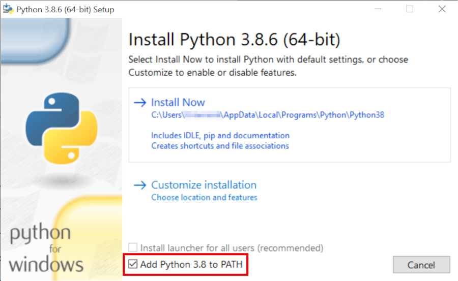
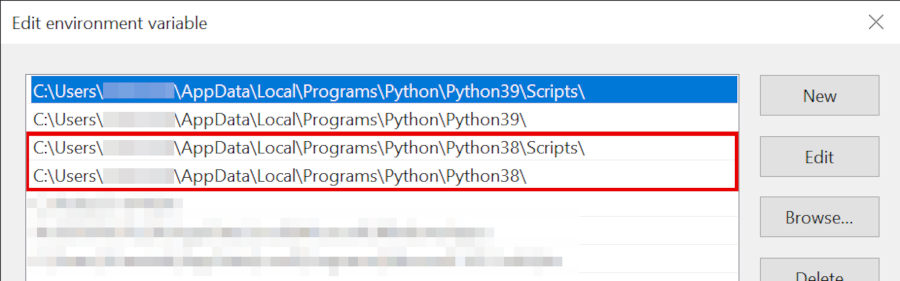

# Installing Python Environment

In order to run the Jupyter notebooks locally, you need to have Python 3.8 installed. To check if you already have it, open up a terminal and run

* Windows: run `py --list-paths` and check if 3.8 is in the list
* macOS/Linux: run `which python3.8` and check if the executable is found

If you have it installed, you can skip the next section and continue with [Install Pipenv](#Install-Pipenv).


## Install Python 3.8
### Windows

Download and run the installer from https://www.python.org/ftp/python/3.8.6/python-3.8.6-amd64.exe

Make sure you select the **Add Python 3.8 to `PATH`** option during installation:



Note: this will prepend the Python 3.8 paths to your `PATH`, i.e. this will
essentially become the default Python version inside your shell. For example,
when you run a script from the command line with `python my_script.py`, the
directories in `PATH` will be searched for the python executable and the first
match is used.

In case you have a different Python version installed and depend on it being
the default, you might want to change the order of your `PATH` entries (Windows
Key > Edit the System Environment Variables > Environment Variables... > Edit
your User Path variable) to move the Python 3.8 entries below your preferred
default version, e.g.:




### macOS

Just download and run the installer from https://www.python.org/ftp/python/3.8.6/python-3.8.6-macosx10.9.pkg

### Linux

* Use your distribution's package manager to install Python 3.8. Common package names are e.g. `python3.8` or `python38`
* Run `python3.8 -m ensurepip --user` to ensure you have the corresponding pip version installed


## Install `pipenv`

In order not to break any of your existing Python installations, we will be
creating a virtual environment for this tutorial using a tool called `pipenv`.
It is just a Python package itself, so you can install it into your Python
3.8 distribution by running

```
pip3.8 install pipenv
```

in a terminal.

> Note for Windows: if this command does not work and you already had Python 3.8
installed, it's probably missing from your `PATH`. Find out the installation
directory with `py --list-paths` and add the two paths like in the "Edit
environment variable" image above to your `PATH` environment variable.

## Working with `pipenv`

### Creating a New Virtual Environment

In the pipenv world, virtual environments are project-based. Each project
needs to have special text file within the project directory. This so-called
_Pipfile_ contains the information about the environment (required Python
version, dependencies, ...).

To create a new virtual environment for a project containing a Pipfile, you
just need to do the following steps:

* open a terminal
* change into the root directory of the project (i.e. the directory containing the Pipfile)
* run `pipenv install`

This will automatically create the new virtual environment using the specified Python version and install all required package dependencies. Depending on the number of packages to install this might take a while.

### Using the Virtual Environment

Once the environment has been successfully created, there are basically two ways to use it:

* `pipenv run`: run a single given command inside the virtual environment, e.g. starting the Python interpreter by running `pipenv run python`. All command arguments will be forwarded.
* `pipenv shell`: spawn a subshell with the virtual environment activated (type `exit` to deactivate it again)

> Note that these commands should always be executed **from within the project directory**!